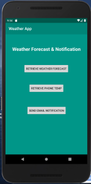

# CYBR 8480 Project Milestone 2: Prototype development

## Overview
Project milestone 2 shows the progress we have made towards developing the app. We will go over the realization that our apps meets are user stories from the first milestone. We will then show some information on the app and what has been done to the application itself. We will also make sure the code has been properly documented so anyone can read it with ease. There will also be a few screen-shot that shows how the app is coming along. We will also show issues we have ran into. This was all developed as a native app becasue android studios has such a nice interface for the users. We did not use a bluetooth or IoT device becasue the teacher in class said it was not needed if the developers did not want it.

## User Stories and Relization
As a **standard user**, I want to **view current temperature and condition** so I can **see what apparel is required for the day**.  
**Acceptance Criteria:**
* App grabs user location
* App is able to interpret data to send off for correct data
* App displays the current temperature and conditions

This task was the main goal to create a functioning weather app for anyone in the US or anywhere else. With a simple area code from your location it can pull relevant data for the user. This was done with weather API. 

As a **standard user**, I want to **receive an email notification** so I can **view the weather forecast outside the application**.  
**Acceptance Criteria:**
* App receives weather forecast from Weather API
* App is able to interpret data to determine the correct forecast
* App is able to send an email notification when the user selects the notification option

This task is still being worked on to send the emails. You can see in the screenshot we have been working on it so at a click of a button it will send the email to the registered email or one you select. We are still working out the bugs on this one. 

As a **standard user**, I want to **view the phones current temperature** so I can **determine if the phone needs to be stored elsewhere**.  
**Acceptance Criteria:**
* App receives data from phone's sensor
* App is able to interpret data to be displayed to screen
* App is able to correctly render the sensors data to the user

This task is a bit tricky because the phone has to allow are app to run in the background and pull the current phone temperature. Then if the phone temperature is too high or too low it will send an email to the user specified email. The bound checking is really easy. It is just getting the email sent and the time frame of when to check the email that has given us some trouble. 

### To Do
Add screenshot
Document code
Finish updating the sheet.
Set app to forground so marked up above and then it wont be killed. Android will ingore system process when you go into a load memory state. So then the app will not be killed.

## Demo (Participation)

Screenshots of the App that show the three user stories.

