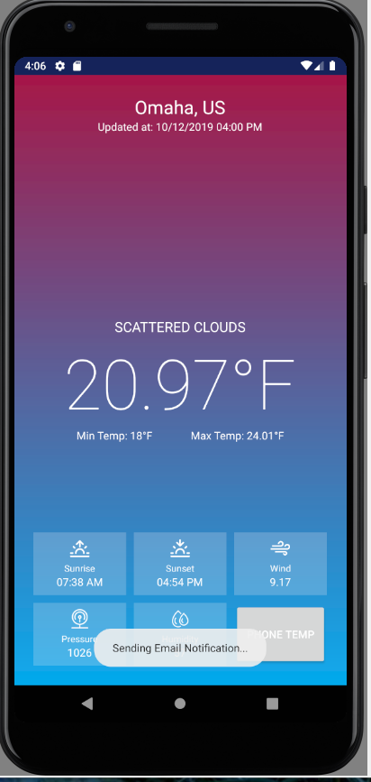
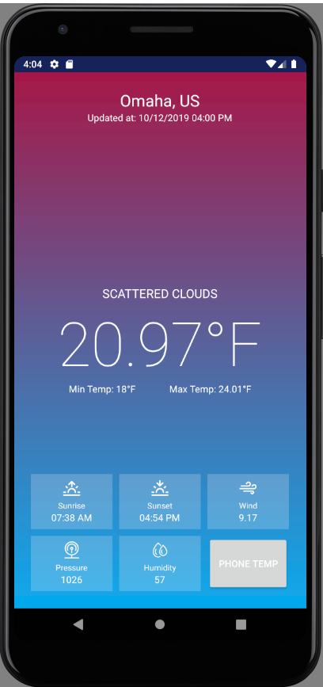
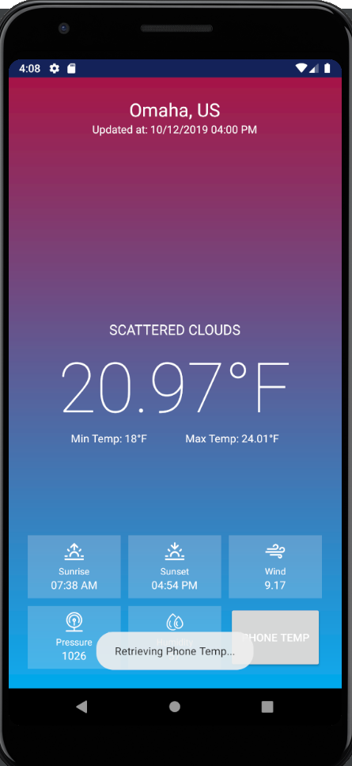

## CYBR 8080 Project Milestone 3: Final MileStone

### Overview
This is the final milestone for the weather app that we have been working on this semester. It can grab data on where the phone is located and reach out to an API called OpenWeather API. Then it sends back the most up to date information for your phone's location. It also will notify the user by email if the phone gets too hot or too cold.

### Polish
Fixed errors that happened in milestone 2.

### Packaging and Release
Download the repository and load it into Android Studio and Android Studios will compile it. If errors happen it is most likely missing dependencies that need to be added. Android Studios will give you a prompt to install them. Once it is done you can load it onto a virtual device or grab the APK and move it to a physical phone.

#### Submission materials
The code can be grabbed from the github repository and compiled by anyone.

#### Hardware/Software Requirements
Software Requirements - Users need Android Studio and a phone that run Android. Android 4: Ice Cream Sandwich and up. We did not want to go back and add all versions becasuse it would take to much space.

Hardware Requirements - Just a Android Device with Android 4: Ice Cream Sandwich or newer.

#### Installation
Git Clone https://github.com/cyb3rc0wb0y/CYBR8480-Project.git (in directory of your choice)
Open Android Studio
File -> Open -> Location of Git Repository
Compile Project / Run App
- If errors occur, follow android studio prereqs. It will suggest the library that is needed to resolve most errors.
Start Emulator or move APK to a Physical Phone

### Walkthrough
When you first start the app it will send an email to the users specfied email.

After the email is sent you have your main screen screen with all your information put up for your viewing with real time hourly updates.

You can hit the phone temperature button to retrieve phone temperature at any given time.

